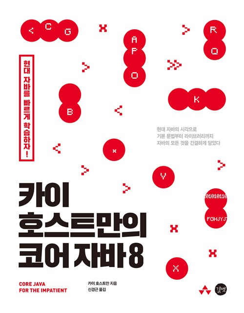

# 카이 호스트만의 코어 자바8 연습문제 코딩
-----------------------------------------

**챕터별 연습문제를 스터디하며 코딩한 것을 올릴 예정입니다.**

-----------------------------------------
> - 책소개
    -   *이 책은 자바 8에 추가된 개념과 특징을 기존 자바에 덧붙인 것이 아니라 
    기본 문법부터 라이브러리까지 현대 자바의 시각으로 자바의 모든 면을 배울 수 있게 
    해준다. 이 책으로 간결하고 빠르게 현대 자바를 배울 수 있다.*

-----------------------------------------

* Chapter10
    ------------
    병행 프로그래밍 
    ------------
    
    * [문제1 코딩](https://github.com/incheol1024/java-eight/blob/master/src/main/java/me/incheol/chapter10/Question1.java)
    * [문제2 코딩](https://github.com/incheol1024/java-eight/blob/master/src/main/java/me/incheol/chapter10/Question2.java)
    * [문제3 코딩](https://github.com/incheol1024/java-eight/blob/master/src/main/java/me/incheol/chapter10/Question3.java)
    * 문제4는 내용이 장황한 관계로 제가 문제를 이해하지 못했습니다. 추후 시간을 내서 올리도록 하겠습니다.
    * [문제5 코딩](https://github.com/incheol1024/java-eight/blob/master/src/main/java/me/incheol/chapter10/Question5.java)
    * [문제6 코딩](https://github.com/incheol1024/java-eight/blob/master/src/main/java/me/incheol/chapter10/Question6.java)
    * [문제7 코딩](https://github.com/incheol1024/java-eight/blob/master/src/main/java/me/incheol/chapter10/Question7.java)
    * [문제8 코딩](https://github.com/incheol1024/java-eight/blob/master/src/main/java/me/incheol/chapter10/Question8.java)
    * [문제9 코딩](https://github.com/incheol1024/java-eight/blob/master/src/main/java/me/incheol/chapter10/Question9.java)
    * [문제10 코딩](https://github.com/incheol1024/java-eight/blob/master/src/main/java/me/incheol/chapter10/Question10.java)
    
    
    
com  
&nbsp;+- etoos  
&nbsp;&nbsp;+- bcp  
&nbsp;&nbsp;+- Application.java  
&nbsp;&nbsp;&nbsp;|  
&nbsp;&nbsp;&nbsp;+- customer
      |   +- Customer.java
      |   +- CustomerController.java
      |   +- CustomerService.java
      |   +- CustomerRepository.java
      |
       +- order
                 +- Order.java
                 +- OrderController.java
                 +- OrderService.java
                 +- OrderRepository.java
